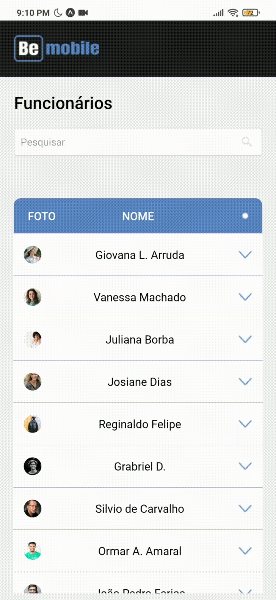
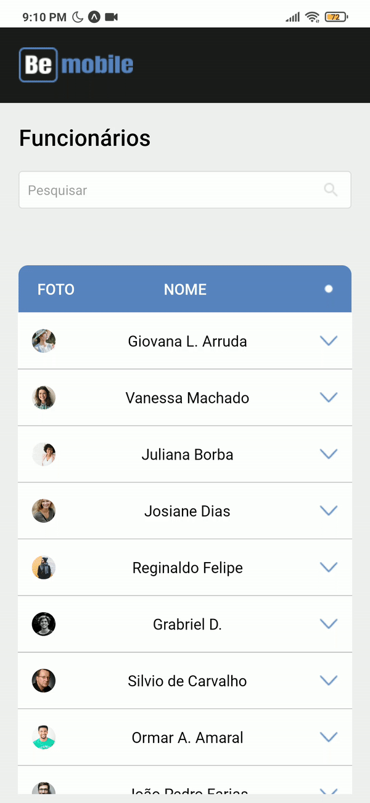

<h1 align="center">Desafio BeMobile</h1>

  
  
  
  

<h1 align="center">:sparkles: Tecnologias</h1>

Esse projeto foi desenvolvido com</h1>
 

<a href="https://reactnative.dev/">React Native</a>

<a href="https://www.typescriptlang.org/">Typescript</a>

<a href="https://expo.io/">Expo</a>

 

<h1 align="center">:computer: Sobre o Projeto</h1>

Projeto desenvolvido com o intuito de mostrar e gerenciar usuários cadastrados em um banco de dados. Podendo pesquisá-los por <strong>Nome</strong>,
<strong>Stack</strong> e <strong>Telefone</strong>

 

<h1 align="center">:ballot_box_with_check: Layout</h1>

Caso você queira ver o layout desse projeto, basta clicar <a href="https://www.figma.com/file/yw6th52zE9bubewc6ayTg5/Teste---Be-mobile?node-id=1%3A3">aqui</a> para ir ao <strong>figma</strong> e observar com mais detalhes :)

 

<h1 align="center">:rocket: Executando o Projeto</h1>

Comece clonando o repositório para sua máquina, usando

<pre>$ git clone https://github.com/marlleyck/desafio-BeMobile/tree/master</pre>

Instale todas as dependências, usando o seu gerenciador de pacotes preferido

<pre>$ npm install</pre>
<pre>$ yarn</pre>
<pre>$ expo install</pre>
